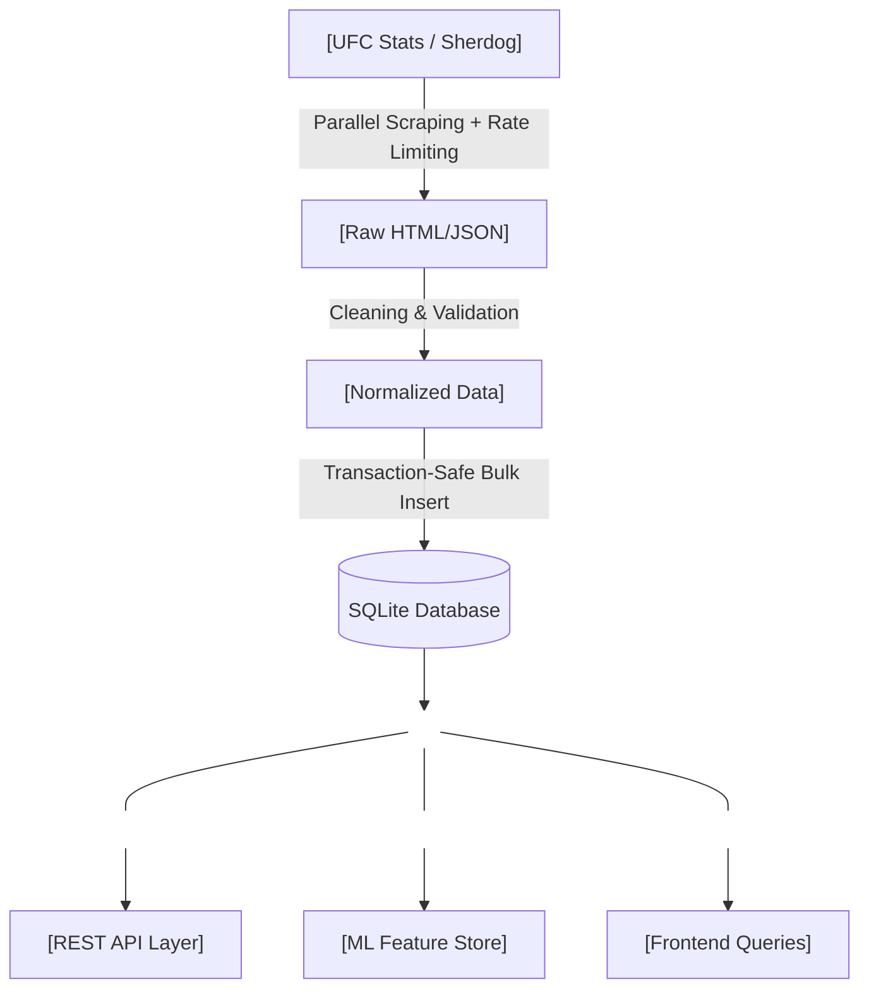

# 🥊 CageMind — MMA Fight Intelligence

[](https://python.org)
[](https://fastapi.tiangolo.com)
[](https://react.dev)
[](LICENSE)
[](https://cagemind.app)

> **UFC Fight Prediction System powered by Machine Learning**  
> CageMind combines web scraping, data analysis, and predictive modeling to deliver statistical insights and win probability forecasts for MMA fights.

🌐 **Live Demo**: [cagemind.app](https://cagemind.app)  
📊 **Data Source**: UFC Stats • Sherdog • Official UFC Records  
🌎 *[Read in Spanish](README.es.md)*

---

## ✨ Key Features

### 🔮 Smart Fight Predictions
- **ML-Powered Forecasts**: XGBoost models with Platt scaling for calibrated win probabilities
- **Confidence Metrics**: Each prediction includes reliability scores and key influencing factors
- **Head-to-Head Analysis**: Compare fighter stats, styles, and historical performance side-by-side

### 📊 Advanced Analytics
- **Fighter Profiles**: Detailed breakdowns of striking, grappling, and cardio metrics
- **Trend Detection**: Identify performance patterns across weight classes and eras
- **Event Insights**: Pre-fight statistics and post-event analysis for every UFC card

### 🔄 Automated Data Pipeline
- **Multi-Source Scraping**: Collects data from UFCStats.com, Sherdog, and official records
- **Checkpoint System**: Resume interrupted scrapes without data loss or duplicates
- **Rate Limiting & Logging**: Respectful crawling with full execution transparency

### 🗄️ Structured Data Layer
- **SQLite Database**: Optimized schema for fast queries on fighter histories and fight outcomes
- **Normalized Stats**: Round-by-round data cleaned and ready for analysis or ML training
- **Export Options**: Download processed datasets in CSV format for external use

### 🌐 Developer-Ready API
- **RESTful Endpoints**: Query fighters, events, and predictions via JSON API
- **Swagger Documentation**: Interactive API docs at `/docs` for easy integration
- **Authentication Ready**: JWT support for protected routes (configurable)

### 🎨 Modern Frontend Experience
- **React + TypeScript**: Type-safe, responsive UI built with Vite
- **Interactive Visualizations**: Charts and comparisons powered by Recharts/D3
- **Dark Mode Support**: User-preference aware design for comfortable viewing

---

## 🗂️ Project Structure

<details>
<summary><b>📁 View complete project structure</b></summary>
cagemind/
├── 📁 .github/
│   └── 📁 workflows/          # CI/CD pipelines (GitHub Actions)
├── 📁 config/                 # Configuration & environment variables
│   ├── 📄 __init__.py
│   └── 📄 settings.py
├── 📁 data/
│   ├── 📄 __init__.py
│   ├── 📁 checkpoints/        # Checkpoints para scrapers resumibles ⭐ NUEVO
│   ├── 📁 exports/            # CSV exports
│   ├── 📁 raw/                # Raw HTML/JSON downloads
│   └── 📁 scrapers/           # UFC Stats & Sherdog scrapers
├── 📁 db/                     # SQLite schema & utilities
│   ├── 📄 __init__.py
│   ├── 📄 schema.py
│   └── 📄 ufc_predictor.db    # Base de datos SQLite
├── 📁 ml/                     # Models, training & predictions
│   ├── 📁 calibration/        # Platt scaling & model calibration ⭐ NUEVO
│   ├── 📁 models/             # Modelos entrenados (.pkl, .json)
│   ├── 📁 results/            # Métricas y logs de entrenamiento
│   └── 📁 semana1/            # Notebooks/analisis por iteración
├── 📁 backend/                # FastAPI application ⭐ REFACTORIZADO
│   ├── 📄 __init__.py
│   ├── 📄 app.py              # Entry point FastAPI
│   ├── 📄 auth.py             # JWT authentication logic
│   ├── 📄 config.py           # Backend-specific config
│   ├── 📄 database.py         # DB connection & session management
│   ├── 📄 schemas.py          # Pydantic models (consolidado)
│   ├── 📁 routers/            # API endpoints modularizados ⭐ CAMBIO
│   │   ├── 📄 __init__.py
│   │   ├── 📄 admin.py
│   │   ├── 📄 analytics.py
│   │   ├── 📄 auth.py
│   │   ├── 📄 events.py
│   │   ├── 📄 fighters.py
│   │   ├── 📄 odds.py
│   │   ├── 📄 picks.py
│   │   ├── 📄 predictions.py
│   │   └── 📄 stats.py
│   └── 📁 services/           # Business logic layer ⭐ NUEVO
│       ├── 📄 __init__.py
│       ├── 📄 explainability.py
│       ├── 📄 fighters.py
│       ├── 📄 odds.py
│       └── 📄 predictions.py
├── 📁 frontend/               # React + TypeScript app (Vite)
│   ├── 📄 index.html
│   ├── 📄 package.json
│   ├── 📄 package-lock.json
│   ├── 📄 postcss.config.js
│   ├── 📄 tailwind.config.js
│   ├── 📄 tsconfig.json
│   ├── 📄 tsconfig.node.json
│   ├── 📄 vercel.json         # Deploy config para Vercel
│   ├── 📄 vite.config.ts
│   ├── 📁 public/
│   └── 📁 src/
│       ├── 📄 App.tsx
│       ├── 📄 main.tsx
│       ├── 📄 index.css
│       ├── 📄 config.ts
│       ├── 📄 vite-env.d.ts
│       ├── 📁 components/
│       ├── 📁 contexts/       # React Context providers ⭐ NUEVO
│       ├── 📁 hooks/          # Custom React hooks ⭐ NUEVO
│       ├── 📁 pages/
│       ├── 📁 services/       # API client services
│       ├── 📁 types/          # TypeScript interfaces ⭐ NUEVO
│       └── 📁 utils/
├── 📁 notebooks/          
│   ├── 📄 01_distribucion_peso.png
│   ├── 📄 02_distribucion_stance.png
│   ├── 📄 ... (más visualizaciones)
│   └── 📁 deep/              
├── 📁 scripts/                # Scripts utilitarios ⭐ NUEVO
│   ├── 📁 scraping/           # Scripts de scraping standalone
│   └── 📁 training/           # Scripts de entrenamiento ML
├── 📄 .gitignore
├── 📄 Procfile                # Deploy config (Railway/Heroku)
├── 📄 nixpacks.toml           # Build config para Nixpacks
├── 📄 requirements.txt
├── 📄 runtime.txt             # Python version pinning
├── 📄 upload_to_supabase.py   # Script Supabase ⭐ NUEVO
└── 📄 README.md

</details>

---
## 📺 Project Demos

### 🔮 Predictive Intelligence in Action


)


<br />

| 🔍 SandBox | 📊 soon |
| :---: | :---: |
|  |  |
---

## 🧠 Machine Learning Models

CageMind uses a multi-model ensemble approach to predict different facets of a fight. Each model is optimized for its specific task, significantly outperforming baseline random probabilities.

### 📊 Model Performance & Benchmarks

| Model | Algorithm | Accuracy | Benchmark |
| :--- | :--- | :--- | :--- |
| **Winner (Win/Loss)** | XGBoost | **64.8%** | 65-70% (Oddsmakers) |
| **Method of Victory** | Logistic Reg. | **51.2%** | 33.3% (Random) |
| **Finish vs. Decision** | Random Forest | **59.9%** | 50.0% (Random) |
| **Round Prediction** | XGBoost | **44.5%** | 25.0% (Random) |

### 🛠️ Model Strategy
* **XGBoost (Winner & Round):** Leverages gradient boosting to handle non-linear relationships between fighter stats (e.g., reach advantage vs. takedown accuracy).
* **Logistic Regression (Method):** Provides well-calibrated probabilities for categorical outcomes (KO/TKO, Submission, Decision).
* **Random Forest (Duration):** Excellent at capturing feature importance to determine if a fight's style matchup leads to a finish.

---

## 🛠️ Technology Stack

### 🔙 Backend & Data Engineering
| Technology | Purpose | Version |
|------------|---------|---------|
| **Python** | Core language for scraping, ML, and API | 3.10+ |
| **FastAPI** | High-performance REST API framework | 0.104+ |
| **Supabase/PostgreSQL** | Lightweight, file-based relational database | 3.x |
| **Pandas** | Data manipulation and analysis | 2.x |
| **NumPy** | Numerical computing and array operations | 1.24+ |
| **Scikit-learn** | ML utilities, preprocessing, model evaluation | 1.3+ |
| **XGBoost** | Gradient boosting for fight prediction models | 1.7+ |
| **Requests + BeautifulSoup4** | HTTP client and HTML parsing for scraping | latest |
| **lxml** | Fast XML/HTML parser for complex scraping tasks | 4.9+ |

### 🎨 Frontend
| Technology | Purpose | Version |
|------------|---------|---------|
| **React** | Component-based UI library | 18.x |
| **TypeScript** | Type-safe JavaScript development | 5.x |
| **Vite** | Fast build tool and dev server | 4.x |
| **Recharts** | Declarative charting library for data viz | 2.x |
| **Tailwind CSS** *(optional)* | Utility-first CSS framework | 3.x |

### 🚀 DevOps & Infrastructure
| Tool | Purpose |
|------|---------|
| **Vercel** | Frontend deployment with CDN and edge functions |
| **Railway / Render** | Backend API hosting with auto-deploy from GitHub |
| **GitHub Actions** | CI/CD pipelines, automated testing, and scheduled scrapes |
| **pre-commit** | Code quality hooks (linting, formatting) |

### 🧪 Testing & Quality
| Tool | Purpose |
|------|---------|
| **pytest** | Unit and integration testing for Python code |
| **Jest + React Testing Library** | Frontend component testing |
| **Black + isort** | Code formatting and import sorting |
| **Flake8 / Ruff** | Linting for PEP8 compliance |

---

## ⚡ Quick Start

Get the project running locally in 3 steps.

### 🔧 Prerequisites
Ensure you have the following installed:
- **Python 3.10+** (for Backend & ML)
- **Node.js 18+** (for Frontend)
- **Git**

---

### 🛠️ Step 1: Installation

#### Backend (Python)
```bash
# Clone the repository
git clone https://github.com/danielreidxd/cagemind.git
cd cagemind

# Create and activate a virtual environment
python -m venv venv
source venv/bin/activate  # On Windows: venv\Scripts\activate

# Install dependencies
pip install -r requirements.txt
```
Frontend (React)
```bash
cd frontend

# Install dependencies
npm install
```

⚙️ Step 2: Configuration
Create a .env file in the root directory:
```bash
# Database configuration
DATABASE_URL=sqlite:///./cagemind.db

# API Settings
API_KEY=your_secret_api_key
ENV=development
```

🚀 Step 3: Run the Application
A) Run the Data Pipeline (Scraping)
```bash
python run_phase1.py
```
B) Start the Backend API
```bash
uvicorn backend.main:app --reload --host 0.0.0.0 --port 8000
```
✅ API: http://localhost:8000 | 📚 Docs: http://localhost:8000/docs
C) Start the Frontend
```bash
cd frontend
npm run dev
```
✅ App: http://localhost:5173
📊 Database Schema & Data Flow
🗄️ Schema Overview

## Estructura de la Base de Datos

| Tabla | Descripción | Campos Clave |
| :--- | :--- | :--- |
| `fighters` | Perfiles de luchadores y atributos físicos | `id`, `name`, `nickname`, `height`, `weight`, `reach`, `stance`, `record` |
| `events` | Metadatos de eventos de la UFC | `id`, `name`, `date`, `location`, `venue` |
| `fights` | Resultados de los combates y metadatos | `id`, `event_id`, `fighter_a_id`, `fighter_b_id`, `winner_id`, `method`, `round`, `time` |
| `fight_stats` | Datos de rendimiento por asalto | `fight_id`, `fighter_id`, `sig_strikes`, `takedowns`, `submissions`, `control_time` |
| `predictions` | Pronósticos de ML (Machine Learning) | `id`, `fight_id`, `fighter_a_prob`, `fighter_b_prob`, `model_version`, `confidence` |

🔗 Relationships: events → fights → fighters → fight_stats
📖 Full schema: db/schema.sql

🔄 Data Flow Pipeline


🔮 ML Predictions & API Usage
🌐 Core Endpoints

## Documentación de la API

| Method | Endpoint | Description |
| :--- | :--- | :--- |
| `GET` | `/api/fighters` | Search & filter fighter profiles |
| `GET` | `/api/fights/{id}` | Retrieve fight details, stats & history |
| `POST` | `/api/predict` | Get ML-powered win probabilities |
| `GET` | `/api/events` | Browse past & upcoming UFC cards |
| `GET` | `/api/stats/trends` | Aggregate performance trends by weight class |

📖 Swagger UI: https://cagemind.app/api/docs
💻 Python Example

```python
import requests

API_BASE = "https://cagemind.app/api"

response = requests.post(
    f"{API_BASE}/predict",
    json={
        "fighter_a": "Alex Pereira",
        "fighter_b": "Magomed Ankalaev",
        "weight_class": "Light Heavyweight"
    }
)

result = response.json()
print(f"Pereira win prob: {result['predictions']['fighter_a']['win_probability']:.1%}")
print(f"Confidence: {result['predictions']['fighter_a']['confidence'].upper()}")
```
🌐 cURL Example
```bash
curl -X POST "https://cagemind.app/api/predict" \
     -H "Content-Type: application/json" \
     -d '{
       "fighter_a": "Islam Makhachev",
       "fighter_b": "Charles Oliveira",
       "weight_class": "Lightweight"
     }'
```

📤 Sample Response
```json
{
  "fight_id": "ufc-294-pereira-vs-ankalaev",
  "predictions": {
    "fighter_a": {
      "name": "Alex Pereira",
      "win_probability": 0.58,
      "confidence": "high",
      "key_advantages": ["striking_power", "takedown_defense"]
    },
    "fighter_b": {
      "name": "Magomed Ankalaev",
      "win_probability": 0.42,
      "confidence": "high",
      "key_advantages": ["wrestling_volume", "cardio"]
    }
  },
  "model_version": "xgboost_v2.3",
  "features_used": 47,
  "generated_at": "2026-04-11T14:22:00Z"
}
```

🧪 Testing, CI/CD & Deployment
✅ Testing Strategy

## Testing & Quality Assurance

| Component | Command | Coverage |
| :--- | :--- | :--- |
| **Backend Unit Tests** | `pytest backend/tests/ -v` | API routes, DB queries |
| **ML Pipeline Tests** | `pytest ml/tests/ -v` | Feature extraction, inference |
| **Frontend Tests** | `cd frontend && npm test` | Components, routing |
| **Integration Tests** | `pytest tests/integration/ -v` | Full flow: scrape → predict |

📊 Coverage report:
```bash
pytest --cov=backend --cov=ml --cov-report=html
```
🔄 CI/CD Pipeline (GitHub Actions)
```yaml
# .github/workflows/ci.yml
name: CI/CD
on: [push, pull_request]
jobs:
  test:
    runs-on: ubuntu-latest
    steps:
      - uses: actions/checkout@v4
      - uses: actions/setup-python@v5
        with: { python-version: '3.10' }
      - run: pip install -r requirements.txt
      - run: pytest --cov=backend --cov=ml
```

🚀 Deployment

## Deployment & Infrastructure

| Service | Role | URL |
| :--- | :--- | :--- |
| **Frontend** | Vercel (Edge React) | `https://cagemind.app` |
| **Backend API** | Railway/Render | `https://api.cagemind.app` |
| **Database** | SQLite/PostgreSQL | Attached to backend |

🐳 Local Docker
```bash
docker-compose up --build    # Build & run
docker-compose up -d         # Detached mode
docker-compose logs -f       # View logs
```
## 🤝 Contributing

Contributions are greatly appreciated! If you have a suggestion that would make this better, please fork the repo and create a pull request.

### How to Contribute

1. **Fork the Project**
2. **Create your Feature Branch**
```bash
   git checkout -b feature/AmazingFeature
```
3.Commit your Changes
```bash
    git commit -m 'feat: add AmazingFeature'
```
4.Push to the Branch
```bash
    git push origin feature/AmazingFeature
```
5.Open a Pull Request

📜 Guidelines
To maintain project quality, please follow these standards:

Python: Follow PEP 8 style guidelines.

Commits: Use Conventional Commits (e.g., feat:, fix:, docs:).

Quality: Always update tests and documentation for any new features or significant changes.

## 🗺️ Roadmap

| Status | Feature | Description |
| :---: | :--- | :--- |
| ✅ | **Data Pipeline** | Scraping from UFC Stats & Sherdog |
| ✅ | **Machine Learning** | XGBoost models with calibration |
| ✅ | **API Backend** | FastAPI REST service + Swagger |
| ✅ | **Web Interface** | React + TypeScript dashboard |
| 🔄 | **Live Predictions** | Real-time inference for upcoming events |
| 📅 | **Mobile App** | React Native companion app |
| 📅 | **Advanced Metrics** | Proprietary "CageScore" algorithm |
