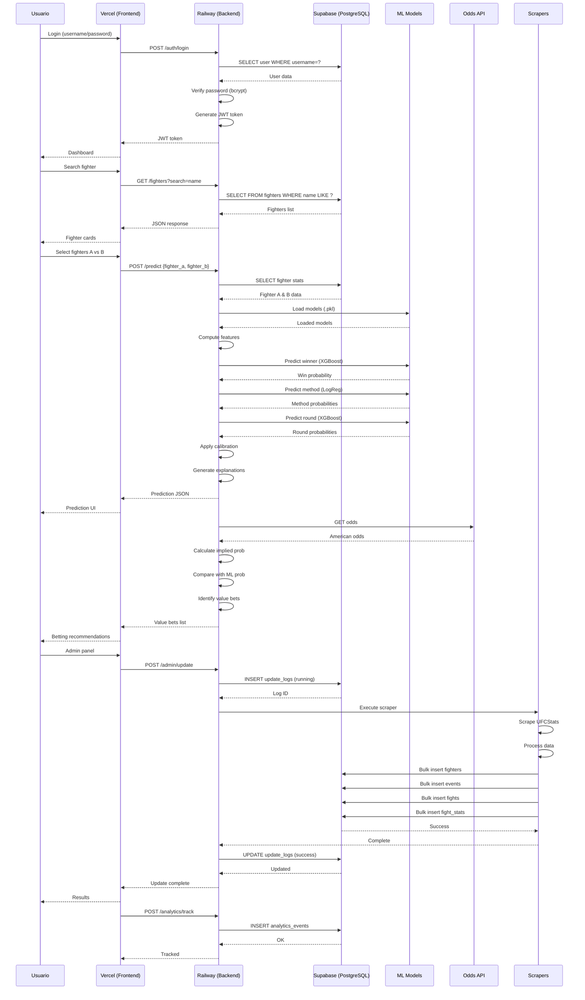
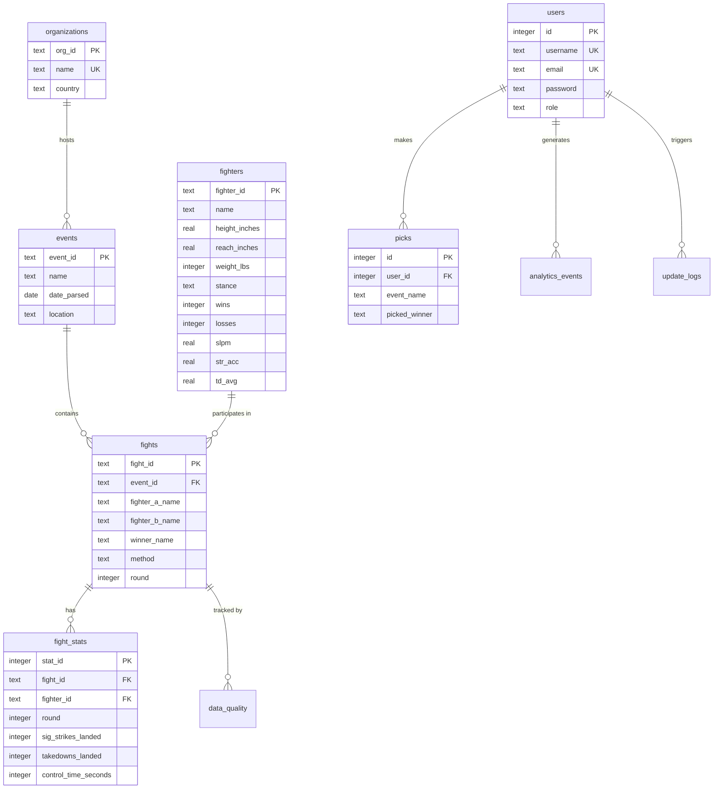
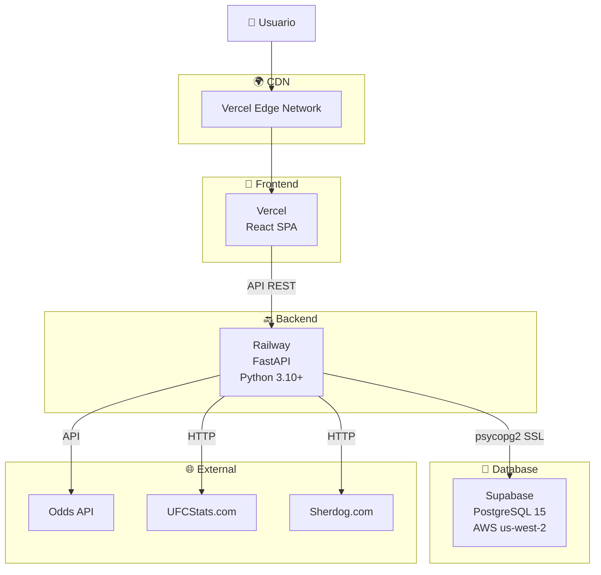
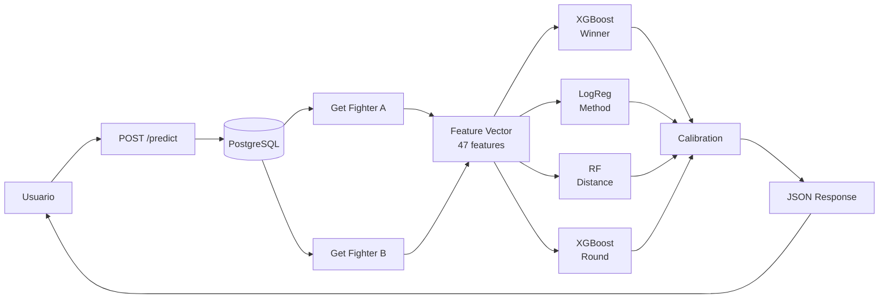

# 🏗️ Arquitectura del Sistema - CageMind

Diagrama completo de la arquitectura del sistema UFC Fight Predictor.

---

## 📊 Diagrama de Arquitectura General

```mermaid
flowchart TB
    subgraph Fuentes["📥 Fuentes de Datos"]
        U1[UFCStats.com]
        S1[Sherdog.com]
        U2[UFC.com]
    end

    subgraph Scraping["🕷️ Scraping Pipeline"]
        direction TB
        SP1[scrape_fighters.py]
        SP2[scrape_events.py]
        SP3[scrape_fights.py]
        SP4[scrape_fight_stats.py]
        SP5[scrape_sherdog.py]
        CP{Checkpoint System}
        RL[Rate Limiter]
        LOG[Logging System]
    end

    subgraph Procesamiento["⚙️ Procesamiento de Datos"]
        direction TB
        CLEAN[Data Cleaning]
        VAL[Validation]
        NORM[Normalization]
        TRANS[Transformation]
        FEAT[Feature Engineering]
    end

    subgraph Almacenamiento["💾 Almacenamiento"]
        direction TB
        PG[("🗄️ PostgreSQL (Supabase)")]
        subgraph Tablas["Tablas (11)"]
            T1[organizations]
            T2[fighters]
            T3[events]
            T4[fights]
            T5[fight_stats]
            T6[data_quality]
            T7[users]
            T8[analytics_events]
            T9[update_logs]
            T10[picks]
            T11[sherdog_features]
        end
    end

    subgraph ML["🤖 Machine Learning"]
        direction TB
        FE[Feature Extraction]
        TRAIN[Model Training]
        CAL[Calibration]
        subgraph Modelos["Modelos Entrenados"]
            M1[Winner Model<br/>XGBoost]
            M2[Method Model<br/>Logistic Regression]
            M3[Distance Model<br/>Random Forest]
            M4[Round Model<br/>XGBoost]
        end
        subgraph Resultados["Resultados"]
            MR1[Model Metrics]
            MR2[Feature Importance]
            MR3[Confusion Matrix]
        end
    end

    subgraph Backend["🔙 Backend API"]
        direction TB
        FASTAPI[FastAPI Server]
        subgraph Routers["Routers (9)"]
            R1[fighters]
            R2[events]
            R3[fights]
            R4[predictions]
            R5[stats]
            R6[auth]
            R7[admin]
            R8[analytics]
            R9[odds]
        end
        subgraph Servicios["Services"]
            S1[predictions.py]
            S2[fighters.py]
            S3[odds.py]
            S4[explainability.py]
        end
        AUTH[JWT Authentication]
        CORS[CORS Middleware]
    end

    subgraph Frontend["🎨 Frontend"]
        direction TB
        REACT[React 18 + TypeScript]
        VITE[Vite Build Tool]
        subgraph Componentes["Componentes"]
            C1[Fighter Cards]
            C2[Event Cards]
            C3[Prediction Sandbox]
            C4[Leaderboard]
            C5[Auth Forms]
        end
        subgraph Contextos["Context API"]
            CT1[AuthContext]
            CT2[ThemeContext]
        end
        TAIL[Tailwind CSS]
    end

    subgraph Deploy["🚀 Deploy & Hosting"]
        direction TB
        VERCEL[Vercel<br/>Frontend]
        RAIL[Railway<br/>Backend API]
        SUPABASE[Supabase<br/>PostgreSQL]
    end

    subgraph Usuarios["👥 Usuarios"]
        direction TB
        USER1[Usuarios Públicos]
        USER2[Administradores]
        USER3[Sistema ML]
    end

    %% Flujo de Datos
    U1 -->|HTTP Requests| SP1
    U1 -->|HTTP Requests| SP2
    U1 -->|HTTP Requests| SP3
    U1 -->|HTTP Requests| SP4
    S1 -->|HTTP Requests| SP5
    
    SP1 --> CP
    SP2 --> CP
    SP3 --> CP
    SP4 --> CP
    SP5 --> CP
    
    CP -->|Datos Crudos| CLEAN
    RL -.-> SP1
    RL -.-> SP2
    RL -.-> SP3
    RL -.-> SP4
    RL -.-> SP5
    
    CLEAN --> VAL
    VAL --> NORM
    NORM --> TRANS
    TRANS --> FEAT
    
    FEAT -->|Bulk Insert| PG
    PG --> T1
    PG --> T2
    PG --> T3
    PG --> T4
    PG --> T5
    PG --> T6
    PG --> T7
    PG --> T8
    PG --> T9
    PG --> T10
    PG --> T11
    
    T2 -->|Fighter Data| FE
    T4 -->|Fight History| FE
    T5 -->|Stats Agregadas| FE
    T11 -->|Pre-UFC Data| FE
    
    FE --> TRAIN
    TRAIN --> M1
    TRAIN --> M2
    TRAIN --> M3
    TRAIN --> M4
    TRAIN --> MR1
    TRAIN --> MR2
    TRAIN --> MR3
    
    M1 --> CAL
    M2 --> CAL
    M3 --> CAL
    M4 --> CAL
    
    CAL -->|Modelos .pkl| FASTAPI
    
    USER1 -->|HTTP/HTTPS| VERCEL
    USER2 -->|HTTP/HTTPS| VERCEL
    
    VERCEL -->|API Calls| RAIL
    RAIL --> FASTAPI
    
    FASTAPI --> R1
    FASTAPI --> R2
    FASTAPI --> R3
    FASTAPI --> R4
    FASTAPI --> R5
    FASTAPI --> R6
    FASTAPI --> R7
    FASTAPI --> R8
    FASTAPI --> R9
    
    R1 --> S2
    R4 --> S1
    R9 --> S3
    R4 --> S4
    
    FASTAPI --> AUTH
    FASTAPI --> CORS
    
    R1 -->|Read| T2
    R2 -->|Read| T3
    R3 -->|Read| T4
    R4 -->|Read/Write| T2
    R4 -->|Read| M1
    R5 -->|Read| T1
    R5 -->|Read| T2
    R5 -->|Read| T3
    R5 -->|Read| T4
    R6 -->|Write| T7
    R7 -->|Read| T1
    R7 -->|Read| T2
    R7 -->|Read| T3
    R7 -->|Read| T4
    R8 -->|Write| T8
    R9 -->|External| ODDS_API
    
    RAIL -->|Read/Write| PG
    VERCEL -->|API REST| RAIL
    
    FASTAPI --> C1
    FASTAPI --> C2
    FASTAPI --> C3
    FASTAPI --> C4
    FASTAPI --> C5
    
    REACT --> VITE
    VITE --> VERCEL
    
    C1 --> TAIL
    C2 --> TAIL
    C3 --> TAIL
    C4 --> TAIL
    C5 --> TAIL
    
    CT1 --> AUTH
    CT2 --> TAIL
    
    USER3 -->|Entrenamiento| TRAIN
    
    ODDS_API[["📊 Odds API<br/>(the-odds-api.com)"]] -.-> R9
    
    %% Estilos
    classDef fuentes fill:#e1f5fe,stroke:#01579b,stroke-width:2px
    classDef scraping fill:#fff3e0,stroke:#e65100,stroke-width:2px
    classDef procesamiento fill:#f3e5f5,stroke:#4a148c,stroke-width:2px
    classDef almacenamiento fill:#e8f5e9,stroke:#1b5e20,stroke-width:2px
    classDef ml fill:#fce4ec,stroke:#880e4f,stroke-width:2px
    classDef backend fill:#fff8e1,stroke:#f57f17,stroke-width:2px
    classDef frontend fill:#e3f2fd,stroke:#0d47a1,stroke-width:2px
    classDef deploy fill:#f1f8e9,stroke:#33691e,stroke-width:2px
    classDef usuarios fill:#ffebee,stroke:#b71c1c,stroke-width:2px
    
    class U1,S1,U2 fuentes
    class SP1,SP2,SP3,SP4,SP5,CP,RL,LOG scraping
    class CLEAN,VAL,NORM,TRANS,FEAT procesamiento
    class PG,T1,T2,T3,T4,T5,T6,T7,T8,T9,T10,T11 almacenamiento
    class FE,TRAIN,CAL,M1,M2,M3,M4,MR1,MR2,MR3 ml
    class FASTAPI,R1,R2,R3,R4,R5,R6,R7,R8,R9,S1,S2,S3,S4,AUTH,CORS backend
    class REACT,VITE,C1,C2,C3,C4,C5,CT1,CT2,TAIL frontend
    class VERCEL,RAIL,SUPABASE deploy
    class USER1,USER2,USER3 usuarios
```

---

## 🔄 Flujo de Datos Detallado

---

## 🗂️ Estructura de la Base de Datos

---

## 🌐 Infraestructura de Deploy

---

## 📈 Flujo de Predicción

